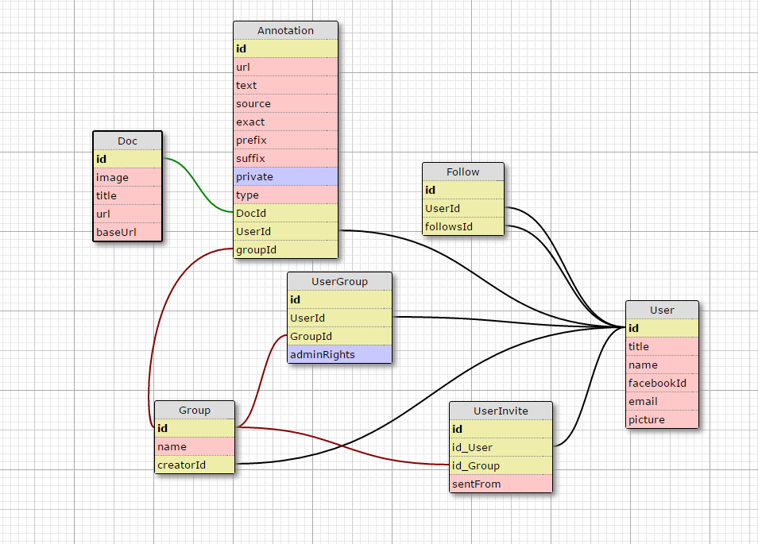
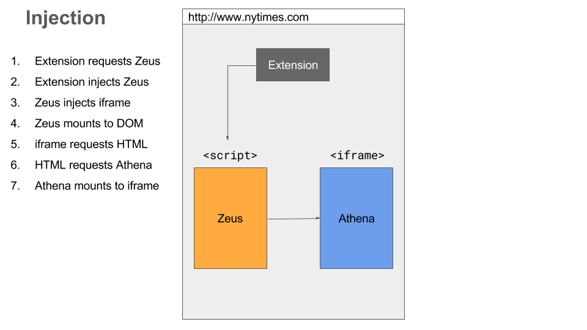
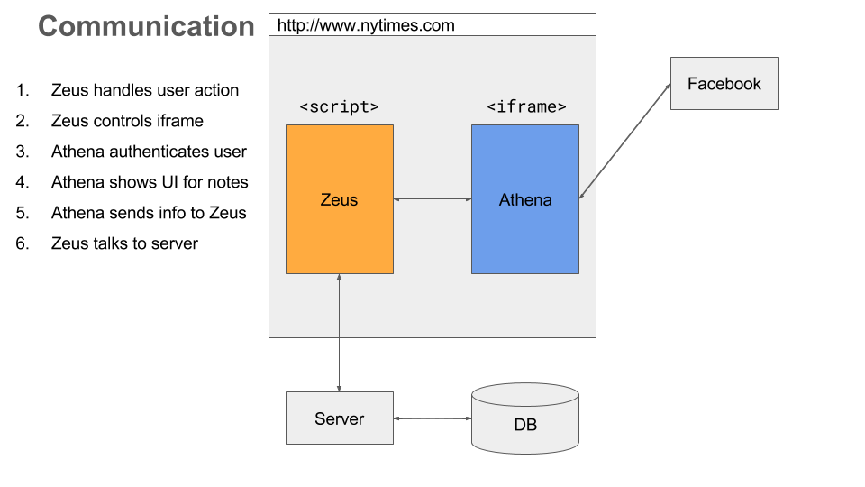

# Athena Annotate

Annotate the web.

## Getting Started

Visit [Athena Annotate](https://athena-annotate.herokuapp.com/).

To use the extension, see [Design](#chrome-extension) Section.

## Tech Stack

* React
* Redux
* Postgres
* Facebook SDK

## Design

### Database

### Web App

### Chrome Extension

The chrome extension is composed of one small program that injects a script tag onto the visited site. 

Here's a visual of the code injection.

And a quick overview of the communication between the modules.

For more information, read [chrome extension details page](docs/CHROME_EXTENSION.md).

## [Workflow](docs/WORKFLOW.md)

## [Deployment](docs/DEPLOYMENT.md)

## [Contributing](docs/CONTRIBUTING.md)

## [License](docs/LICENSE.md)

